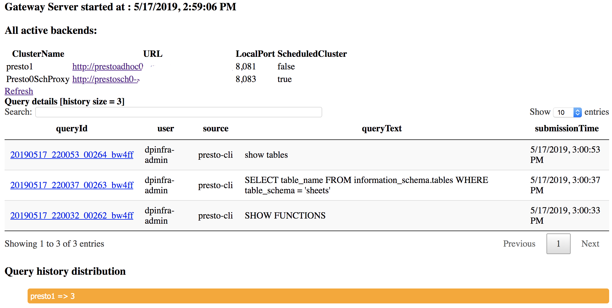

# presto-gateway
A load balancer / proxy / gateway for presto compute engine.

## Getting Started 

### Build and run
run `mvn clean install` to build `presto-gateway`

Edit the [config file](gateway/src/main/resources/config.yml.template) and update backend urls 

```
cd gateway/target/
java -jar gateway-{{VERSION}}-jar-with-dependencies.jar server ../src/presto-gateway/gateway/src/main/resources/config.yml.template
```
Now you can access load balanced presto at localhost:8080 port. We will refer to this as `prestogateway.lyft.com`
 
### Query History UI - check query plans etc.
PrestoGateway records history of recent queries and displays links to check query details page in respective presto cluster.  
 

### Adhoc vs Scheduled query routing
In the [config](gateway/src/main/resources/config.yml.template) 
you can specify if a backend cluster is a part of a routing group. 
If not specified, cluster will be part of `adhoc` routing group by default.

PrestoGateway router will route any request to `scheduled` group of clusters if request contains header `X-Presto-Routing-Group: scheduled` and there are clusters present with config `routingGroup: scheduled`.

If no matching `routingGroup` found, router will route to `adhoc` group of clusters. Please make sure there are clusters under `adhoc` routing group.  

## Gateway API

### Get all backends behind the gateway

`curl -X GET prestogateway.lyft.com/gateway/backend/all | python -m json.tool`
```
[
    {
        "active": true,
        "includeInRouter": true,
        "localPort": 8081,
        "name": "presto1",
        "proxyTo": "http://presto1.lyft.com",
        "routingGroup": "adhoc"
    },
    {
        "active": true,
        "includeInRouter": true,
        "localPort": 8083,
        "name": "presto3",
        "proxyTo": "http://presto3.lyft.com",
        "routingGroup": "adhoc"
    },
    {
        "active": true,
        "includeInRouter": true,
        "localPort": 8082,
        "name": "presto2",
        "proxyTo": "http://presto2.lyft.com",
        "routingGroup": "adhoc"
    }
]
```

### Get active backends behind the Gateway

`curl -X GET prestogateway.lyft.com/gateway/backend/active | python -m json.tool`
```
[
    {
        "active": true,
        "includeInRouter": true,
        "localPort": 8081,
        "name": "presto1",
        "proxyTo": "http://presto1.lyft.com",
        "routingGroup": "adhoc"
    },
    {
        "active": true,
        "includeInRouter": true,
        "localPort": 8082,
        "name": "presto2",
        "proxyTo": "http://presto2.lyft.com",
        "routingGroup": "adhoc"
    },
    {
        "active": true,
        "includeInRouter": true,
        "localPort": 8083,
        "name": "presto3",
        "proxyTo": "http://presto3.lyft.com",
        "routingGroup": "adhoc"
    }
]
```
### Deactivate a backend 

`curl -X POST prestogateway.lyft.com/gateway/backend/deactivate/presto2`

Verify this by calling get active backends
```
curl -X GET prestogateway.lyft.com/gateway/backend/active | python -m json.tool
[
    {
        "active": true,
        "includeInRouter": true,
        "localPort": 8081,
        "name": "presto1",
        "proxyTo": "http://presto1.lyft.com",
        "routingGroup": "adhoc"
    },
    {
        "active": true,
        "includeInRouter": true,
        "localPort": 8083,
        "name": "presto3",
        "proxyTo": "http://presto3.lyft.com",
        "routingGroup": "adhoc"
    }
]
```
### Activate a backend 

curl -X POST prestogateway.lyft.com/gateway/backend/activate/presto2

Verify this by calling get active backends
```
curl -X GET localhost:8090/gateway/backend/active | python -m json.tool

[
    {
        "active": true,
        "includeInRouter": true,
        "localPort": 8081,
        "name": "presto1",
        "proxyTo": "http://presto1.lyft.com",
        "routingGroup": "adhoc"
    },
    {
        "active": true,
        "includeInRouter": true,
        "localPort": 8082,
        "name": "presto2",
        "proxyTo": "http://presto2.lyft.com",
        "routingGroup": "adhoc"
    },
    {
        "active": true,
        "includeInRouter": true,
        "localPort": 8083,
        "name": "presto3",
        "proxyTo": "http://presto3.lyft.com",
        "routingGroup": "adhoc"
    }
]
```
