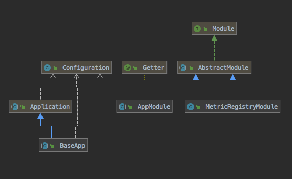
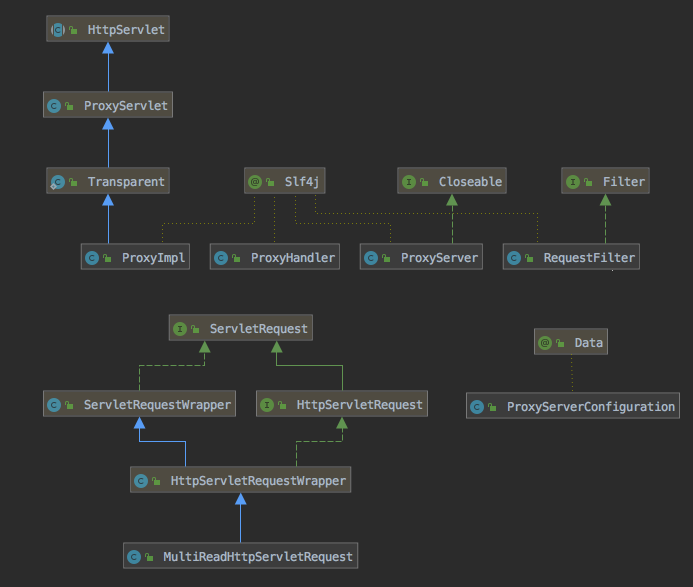
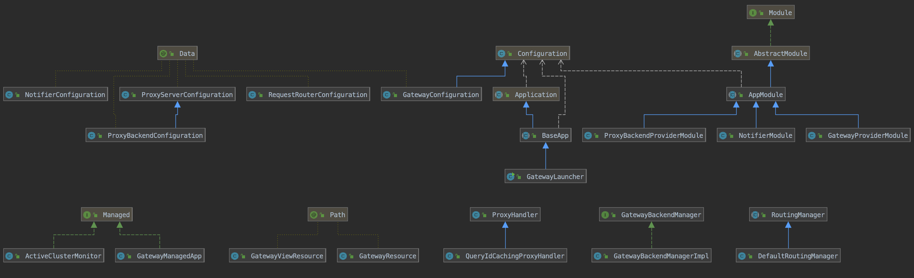

Presto Gateway has 3 components
-------------------------------
1. BaseApp - It provides boilerplate code to add/remove pluggable components with config and metrics registration module.
 

2. ProxyServer - Its a library built on top of jetty proxy which provides a proxy server with a pluggable proxy-handler.
 

3. Gateway - This component acts as container for proxy-server and plugs in ProxyHanders to provide proxy, routing and load balancing functionalities. It also exposes few end points and UI to activate, deactivate backends and view query history for recently submitted queries.
 
