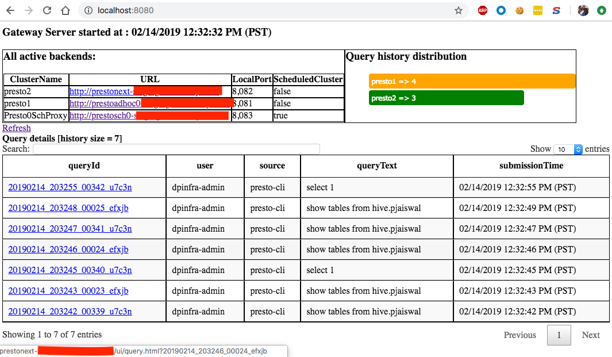
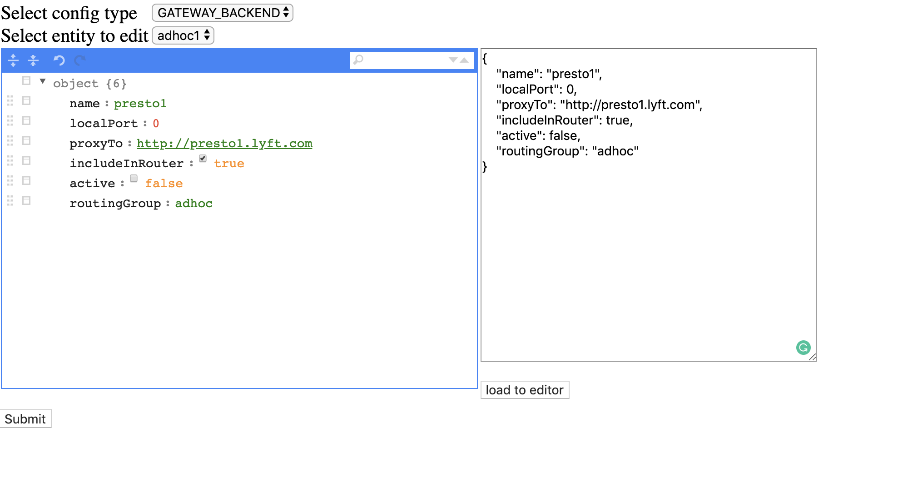

Gateway-HA
==========

## Getting Started 

### Build and run
run `mvn clean install` to build `presto-gateway`

Edit the [config file](../gateway/src/main/resources/config.yml.template) and update the mysql db information.

```
cd gateway-ha/target/
java -jar gateway=ha-{{VERSION}}-jar-with-dependencies.jar server ../config.yml.template
```
Now you can access load balanced presto at localhost:8080 port. We will refer to this as `prestogateway.lyft.com`
 
### Query History UI - check query plans etc.
PrestoGateway records history of recent queries and displays links to check query details page in respective presto cluster.  
 

### Gateway Admin UI - add and modify backend information
The Gateway admin page is used to configure the gateway to multiple backends. Existing backend information can also be modified using the same.
 

How to setup a dev environment
----------------------------

Step 1: setup mysql. Install docker and run the below command when setting up first time:
```$xslt
docker run -d -p 3306:3306  --name mysqldb -e MYSQL_ROOT_PASSWORD=root123 -e MYSQL_DATABASE=prestogateway -d mysql:5.7
```
Next time onwards, run the following commands to start mysqldb

```$xslt
docker start mysqldb
```
Now open mysql console and install the presto-gateway tables:
```$xslt
mysql -uroot -proot123 -h127.0.0.1 -Dprestogateway

```
Once logged in to mysql console, please run [gateway-ha-persistence.sql](/src/main/resources/gateway-ha-persistence.sql) to populate the tables.


Step 2: Edit the configuration `gateway-ha.yml`

Step 3: Add below program argument to class `HaGatewayLauncher` and debug in IDE 
```$xslt
server /path/to/gateway-ha/src/test/resources/config-template.yml
``` 

## Gateway HA API

### Get all backends behind the gateway

`curl -X GET prestogateway.lyft.com/gateway/backend/all | python -m json.tool`
```
[
    {
        "active": true,
        "name": "presto1",
        "proxyTo": "http://presto1.lyft.com",
        "routingGroup": "adhoc"
    },
    {
        "active": true,
        "name": "presto3",
        "proxyTo": "http://presto3.lyft.com",
        "routingGroup": "adhoc"
    },
    {
        "active": true,
        "name": "presto2",
        "proxyTo": "http://presto2.lyft.com",
        "routingGroup": "adhoc"
    }
]
```
### Delete a backend from the gateway

```
curl -v -H "Content-Type: application/json" -d '{"name": "presto3"}' http://prestogateway.lyft.com/gateway/backend/modify/delete
```

Verify this by calling get active backends
```
curl -X GET prestogateway.lyft.com/gateway/backend/active | python -m json.tool

[
    {
        "active": true,
        "name": "presto1",
        "proxyTo": "http://presto1.lyft.com",
        "routingGroup": "adhoc"
    },
    {
        "active": true,
        "name": "presto2",
        "proxyTo": "http://presto2.lyft.com",
        "routingGroup": "adhoc"
    }
]

```
### Add a backend to the gateway

```
curl -v -H "Content-Type: application/json" -d '{"name": "presto3","proxyTo": "http://presto3.lyft.com","active": false,"routingGroup": "adhoc"}' http://prestogateway.lyft.com/gateway/backend/modify/add
```

Verify this by calling get active backends
```
curl -X GET prestogateway.lyft.com/gateway/backend/active | python -m json.tool

[
    {
        "active": true,
        "name": "presto1",
        "proxyTo": "http://presto1.lyft.com",
        "routingGroup": "adhoc"
    },
    {
        "active": true,
        "name": "presto2",
        "proxyTo": "http://presto2.lyft.com",
        "routingGroup": "adhoc"
    },
    {
         "active": true,
         "name": "presto3",
         "proxyTo": "http://presto3.lyft.com",
         "routingGroup": "adhoc"
    }
]
```
### Update backend information 

```
curl -v -H "Content-Type: application/json" -d '{"name": "presto3","localPort": 8084,"proxyTo": "http://presto3.lyft.com","includeInRouter": true,"active": false,"routingGroup": "adhoc"}' http://prestogateway.lyft.com/gateway/backend/modify/add
```

Verify if the port number is updated by calling get active backends
```
curl -X GET prestogateway.lyft.com/gateway/backend/active | python -m json.tool

[
    {
        "active": true,
        "name": "presto1",
        "proxyTo": "http://presto1.lyft.com",
        "routingGroup": "adhoc"
    },
    {
        "active": true,
        "name": "presto2",
        "proxyTo": "http://presto2.lyft.com",
        "routingGroup": "adhoc"
    },
    {
         "active": true,
         "name": "presto3",
         "proxyTo": "http://presto3.lyft.com",
         "routingGroup": "adhoc"
    }
]
```
### Get all active backend behind the Gateway

`curl -X GET prestogateway.lyft.com/gateway/backend/active | python -m json.tool`
```
[
    {
        "active": true,
        "name": "presto1",
        "proxyTo": "http://presto1.lyft.com",
        "routingGroup": "adhoc"
    },
    {
        "active": true,
        "name": "presto2",
        "proxyTo": "http://presto2.lyft.com",
        "routingGroup": "adhoc"
    },
    {
        "active": true,
        "name": "presto3",
        "proxyTo": "http://presto3.lyft.com",
        "routingGroup": "adhoc"
    }
]
```
### Deactivate a backend 

`curl -X POST prestogateway.lyft.com/gateway/backend/deactivate/presto2`

Verify this by calling get active backends
```
curl -X GET prestogateway.lyft.com/gateway/backend/active | python -m json.tool
[
    {
        "active": true,
        "name": "presto1",
        "proxyTo": "http://presto1.lyft.com",
        "routingGroup": "adhoc"
    },
    {
        "active": true,
        "name": "presto3",
        "proxyTo": "http://presto3.lyft.com",
        "routingGroup": "adhoc"
    }
]
```
### Activate a backend 

`curl -X POST prestogateway.lyft.com/gateway/backend/activate/presto2`

Verify this by calling get active backends
```
curl -X GET prestogateway.lyft.com/gateway/backend/active | python -m json.tool

[
    {
        "active": true,
        "name": "presto1",
        "proxyTo": "http://presto1.lyft.com",
        "routingGroup": "adhoc"
    },
    {
        "active": true,
        "name": "presto2",
        "proxyTo": "http://presto2.lyft.com",
        "routingGroup": "adhoc"
    },
    {
        "active": true,
        "name": "presto3",
        "proxyTo": "http://presto3.lyft.com",
        "routingGroup": "adhoc"
    }
]
```
